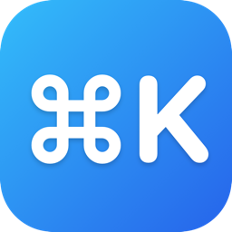

<p align="center">
  
</p>

<h1 align="center">MACKey</h1>

<p align="center">Bind a global hotkey to any Dock app and launch / switch in a keystroke — a lightweight Snap alternative for macOS.</p>

<p align="center"><a href="README.md">中文说明</a></p>

MACKey lives in your menu bar. It reads your Dock and auto-assigns `⌃1`…`⌃0` to the **first 10** apps — press one to launch or switch to it. It also lists macOS's own global shortcuts so you can avoid conflicts.

## Features

- **Auto-bind by Dock order**: the first 10 Dock apps map to `⌃1 ⌃2 … ⌃9 ⌃0`. Works out of the box; fully re-mappable.
- **Three-column settings**: system shortcuts · your bound shortcuts · Dock apps with a recorder.
- **Conflict detection**: while recording, clashes with a system or third-party shortcut are highlighted (system ones are named).
- **Launch at login**: one toggle in the menu.
- **Menu-bar only**: no Dock clutter.

## Install

1. Download the latest `MACKey-x.y.z.dmg` from [Releases](../../releases).
2. Open it and drag `MACKey.app` into `Applications`.
3. First launch: because the app isn't notarized (no paid Apple Developer account), Gatekeeper will block it. **Right-click → Open**, then confirm. (Once only.)
   - Or run: `xattr -dr com.apple.quarantine /Applications/MACKey.app`
4. Grant **Accessibility** permission (required for global hotkeys):
   System Settings → Privacy & Security → Accessibility → enable MACKey.

## Usage

- Click the `⌘K` menu-bar item → "设置快捷键…" to open the window.
- The first 10 apps are pre-bound to `⌃digit`. To change one, click its field in the third column and press a new combo (must include `⌘/⌃/⌥/⇧`).
- `Esc` cancels recording, `×` clears a binding.

> Note: `⌃1`–`⌃3` may clash with "Switch to Desktop N" if Spaces shortcuts are enabled — just pick another key (the red hint flags it).

## Build from source

Requires macOS 13+ and the Swift 6 toolchain.

```bash
git clone https://github.com/hunters1431/MACKey.git
cd MACKey
swift run             # run (debug)
./scripts/make_icon.swift  # regenerate the app icon (optional)
./scripts/package.sh  # produce MACKey.app + DMG
```

Built with Swift + SwiftUI + AppKit; global hotkeys via [HotKey](https://github.com/soffes/HotKey).

## Support

If MACKey helps you, consider supporting development — see the "☕ Support" item in the menu, or [Ko-fi](https://ko-fi.com/hunters1431) / [PayPal](https://paypal.me/hunters1431).

## License

[MIT](LICENSE)
